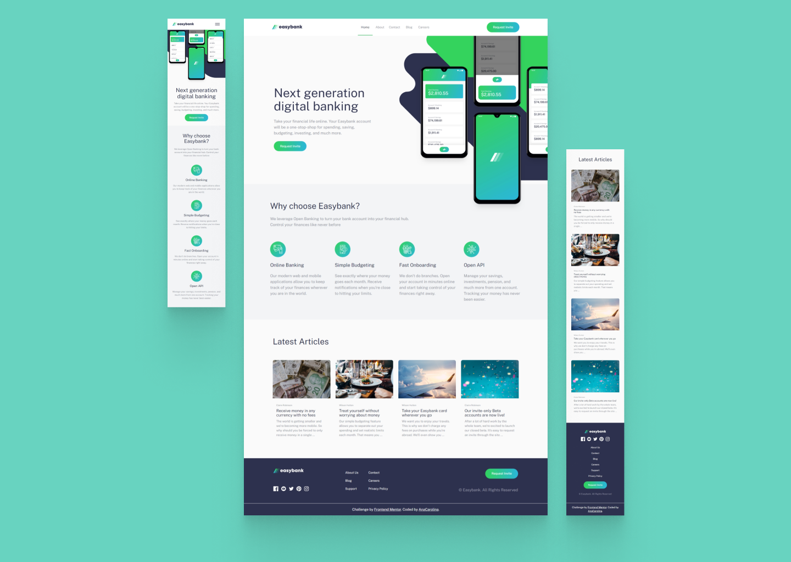

# Frontend Mentor - Easybank landing page solution

This is a solution to the [Easybank landing page challenge on Frontend Mentor](https://www.frontendmentor.io/challenges/easybank-landing-page-WaUhkoDN). Frontend Mentor challenges help you improve your coding skills by building realistic projects.

## Table of contents

- [Overview](#overview)
  - [The challenge](#the-challenge)
  - [Screenshot](#screenshot)
- [My process](#my-process)
  - [Built with](#built-with)
  - [What I learned](#what-i-learned)
  - [Continued development](#continued-development)
  - [Useful resources](#useful-resources)
- [Author](#author)
- [Acknowledgments](#acknowledgments)

### The challenge

Users should be able to:

- View the optimal layout for the site depending on their device's screen size
- See hover states for all interactive elements on the page

### Screenshot

## My process

### Built with

- Semantic HTML5 markup
- CSS custom properties
- Flexbox
- CSS Grid
- Mobile-first workflow
- [Vite](https://vitejs.dev/) - Frontend tooling
- [React](https://reactjs.org/) - JS library
- [Styled Components](https://styled-components.com/) - For styles
- [Framer Motion](https://www.framer.com/motion/) - For animations

### What I learned

Developing this static website, I put into practice the basic concepts of React, such as the JSX syntax, nested components, build-in/custom hooks, displaying data, conditional rendering, and handling events. I also refactor this project, taking into consideration the composition pattern.

It also was an opportunity to learn new techs: the Styled Components for styling and Framer Motion for animations. Due to my good understanding of CSS, it was relativity quick and easy to learn the basics and apply these tools.

### Continued development

In the future, I plan to learn and use more complex React concepts, like fetching data from an API and updating the UI or even trying React Router. Moreover, I plan to learn more about Framer Motion to build complex animations and try some CSS frameworks like Tailwind CSS.

### Useful resources

- [React Js — 8 best practices + Folder Structure](https://medium.com/@kthamodaran/react-8-best-practices-folder-structure-5dbda48a69e) - Helped me structure this project.

- [How To Create Absolute Imports In Vite React App: A step-by-step Guide](https://dev.to/andrewezeani/how-to-create-absolute-imports-in-vite-react-app-a-step-by-step-guide-28co) - Learn a better way to import.

- [How to implement useMediaQuery hook in React](https://dev.to/juhanakristian/how-to-implement-usemediaquery-hook-in-react-1lc0) - learn how to implement a custom hook for media query.

- [Animate Styled Components with Framer Motion!](https://dev.to/darthknoppix/animate-styled-components-with-framer-motion-2202) - This article helped understand how to connect Framer Motion components with Styled Components.

- [Framer Motion Documentation Examples](https://www.framer.com/motion/examples/) - Inspiration animations.

- [Fun ways to animate CSS gradients](https://youtu.be/f3mwKLXpOLk?si=6KweNk-GXfTbiECr) - Cool video to learn how to animate gradients with CSS, helped me with the hover effect in the call to action button.

- [SVGR Playground](https://react-svgr.com/playground/?svgo=false) - Tool to easily transform a SVG into React Component.

- [Easing functions - Examples](https://easings.net/#)

## Author

- Frontend Mentor - [AnaCarolina](https://www.frontendmentor.io/profile/AnaCarol2001)
